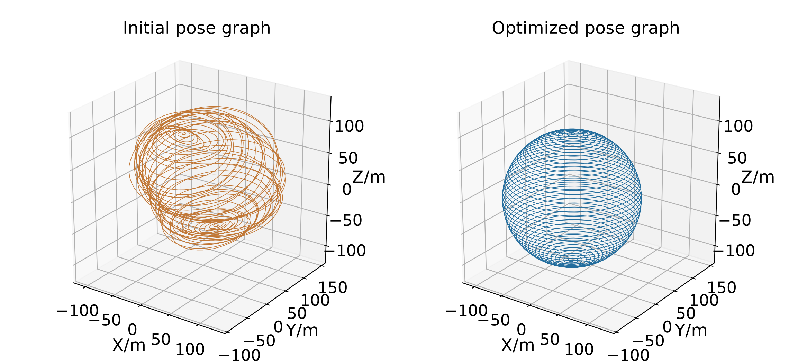
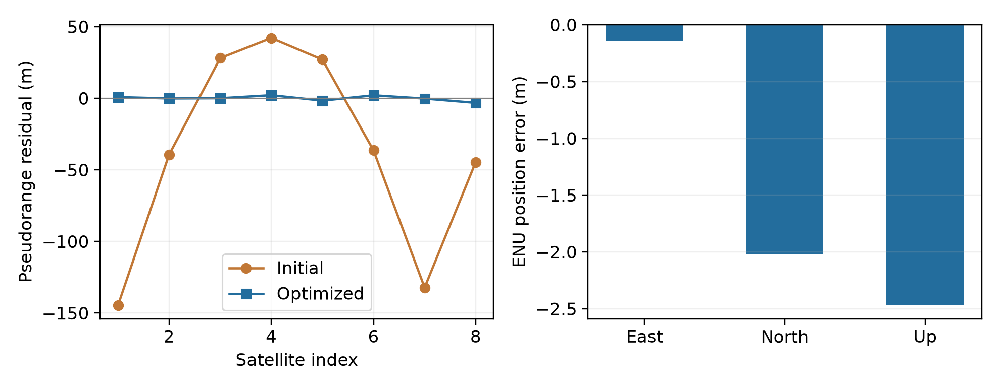

# 因子图优化案例

本目录对应数学基础章节2.3，使用GTSAM完成球形位姿图优化和GNSS单历元伪距定位。两个案例采用相同思路：确定未知状态，依据观测建立因子，指定噪声模型，再从初值出发进行非线性优化。IMU预积分案例暂未实现。

## 目录与运行

```text
因子图优化/
├── environment.yml                  # Conda环境
├── run_all.py                       # 统一运行入口
├── 案例1-球形位姿图优化/
│   ├── sphere_demo.py
│   ├── data/                        # 原始sphere.g2o及来源说明
│   └── results/                     # 参考运行结果
├── 案例2-GNSS单历元伪距定位/
│   ├── gnss_demo.py
│   └── results/                     # 仿真观测及参考运行结果
└── 例3-IMU预积分/                    # 预留目录
```

安装Conda或Miniforge后，从**仓库根目录**执行：

```powershell
cd .\因子图优化
conda env create -f environment.yml
conda activate gtsam-graph-demo
python run_all.py
```

环境使用Python 3.12、GTSAM 4.3.0、NumPy和Matplotlib。单独运行一个案例：

```powershell
python run_all.py --case sphere
python run_all.py --case gnss
```

两个案例脚本也可直接运行，例如`python "案例2-GNSS单历元伪距定位/gnss_demo.py"`。每个案例默认将结果写入同级`outputs/`目录，重复运行会覆盖同名结果；该目录已加入Git忽略规则。`results/`保留本次教学展示的参考结果。脚本支持`--output-dir`指定其他输出位置，不需要本机专用的环境路径配置。

## 案例1 球形位姿图优化

1. **读取数据**：`data/sphere.g2o`提供2500个位姿初值和9799条相对位姿观测，测量权重使用文件中的信息矩阵。数据来源及原始许可证见[data/README.md](案例1-球形位姿图优化/data/README.md)。
2. **建立约束**：每个位姿为一个`Pose3`变量，两个位姿之间的观测形成相对位姿因子。只使用相对约束时，整张图仍能共同平移、旋转；因此在首个位姿处加入强先验，固定坐标参考。
3. **联合求解**：使用LM调整全部位姿，最多迭代100次，相对代价下降阈值为`1e-6`。输出轨迹对比、代价曲线、每次迭代的CSV和优化后的g2o文件。

相对位姿残差采用测量为基准的六维局部坐标：

$$r_{ij}=\operatorname{Local}_{Z_{ij}}(T_i^{-1}T_j).$$

这里没有添加“必须位于球面”的几何约束，球形结构来自相对观测的一致关系。数据没有独立真值，目标函数下降表示约束拟合改善，不能直接换算成定位精度。Windows下读取g2o前会将数据暂存到临时目录，以处理GTSAM文件接口对中文路径的限制；原始数据保持不变。



## 案例2 GNSS单历元伪距定位

1. **生成观测**：在纬度30°、经度114°、WGS-84椭球高50 m的参考位置，按不同视线生成8颗卫星坐标，钟差等效距离真值为75 m。伪距叠加标准差3 m的独立高斯噪声，随机种子固定为7；位置初值在三个ECEF轴上分别偏置100、−80、60 m，钟差初值为0。
2. **建立模型**：一个四维变量表示接收机ECEF位置与钟差等效距离`[X, Y, Z, b]`，其中`b=cδt`，全部以米为单位。每颗卫星提供一个标量伪距因子，用`CustomFactor`表达残差及解析雅可比。
3. **求解与评价**：使用LM估计位置和钟差，最多迭代50次，相对代价下降阈值为`1e-9`。同时检查雅可比、几何矩阵秩、目标函数下降，并输出位置误差、伪距残差、协方差及观测CSV。

$$r_j=\|p-s_j\|+b-\rho_j,\qquad
F=\frac12\sum_j\frac{r_j^2}{\sigma_j^2}.$$

其中卫星坐标`s_j`、校正伪距`ρ_j`和噪声标准差`σ_j`是已知量。至少需要四颗几何合适的卫星，使组合雅可比满列秩。伪距残差衡量观测拟合，位置误差则通过独立的仿真真值计算，两者含义不同。

本例假设卫星钟差、大气传播与地球自转等效应已校正，未实现广播星历和实测观测文件处理。单历元因子图与相同噪声假设下的非线性加权最小二乘等价。



## 参考结果

以下结果由本目录脚本实际运行得到，完整数值见各案例`results/metrics.json`。不同依赖版本可能带来少量数值或迭代次数差异。

| 案例与指标 | 初值 | 优化后 |
|---|---:|---:|
| 球形位姿图目标函数F | 4.78072×10⁹ | 6.37891×10⁴ |
| GNSS目标函数F | 2585.58 | 1.26685 |
| GNSS三维位置误差/m | 141.421 | 3.193 |
| GNSS伪距残差均方根/m | 76.273 | 1.688 |
| GNSS钟差等效距离b/m | 0 | 72.975 |

## 参考资料

- [GTSAM官方教学文档](https://gtsam.org/tutorials/intro.html)：因子图、状态取值与位姿图建模。
- [GTSAM CustomFactor文档](https://borglab.github.io/gtsam/customfactor/)：自定义残差与雅可比。
- [ESA Navipedia伪距定位模型](https://gssc.esa.int/navipedia/index.php/Code_Based_Positioning_(SPS))。
